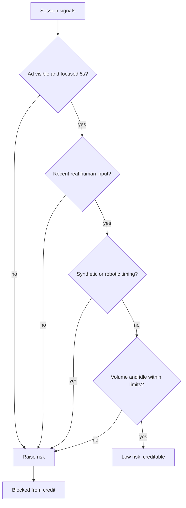
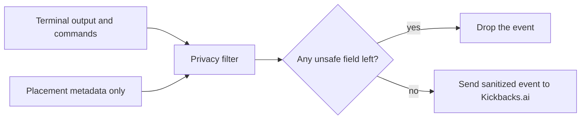
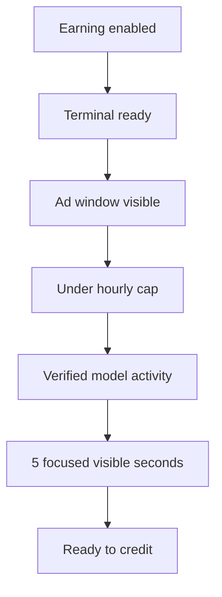

# Kickbacks

A standalone desktop terminal for opt-in, ad-supported AI CLI sessions. You run your normal shell and CLIs. When earning mode is on, sponsor placements show alongside the terminal and you get a share of the revenue. Raw terminal output stays on your machine.

## Note to Andrew

I saw Kickbacks had an issue, so I built this as my take on a fix. It is a working first pass, not a pitch. Take whatever is useful: the whole app, just the trust scoring, just the privacy filter, or none of it. No strings.

## Run it

```
npm install
npm run dev
```

That starts Vite, compiles the Electron main process, and opens the app. Login accepts any input in this build.

```
npm test     # run the unit tests
npm run build  # type-check and produce a production build
```

## Safeguards

Three problems matter here: don't let advertisers pay for fake views, don't leak the user's work, and don't pay out unless the conditions are actually met. Each has its own module.

### Safeguard the advertiser

`src/shared/trustScoring.ts` scores each earning session for fraud signals before anything gets credited. Synthetic input, robotic timing, idle-while-earning, hidden or unfocused ad windows, and abnormal ad volume all raise the risk score. High risk means no credit.



### Lock down the user

`src/shared/privacyTelemetry.ts` builds the only events that ever leave the app. Terminal output, commands, working directory, prompt text, transcripts, project paths, stdout, and stderr are stripped. A guard rejects any event still carrying those fields, so they cannot be sent by accident.



### Make sure it works

`src/shared/sessionProofState.ts` is the gate before any payout. Every condition has to pass in order, and the current state is shown to the user so they always know why they are or are not earning.



## Layout

- `src/main` Electron main process and PTY-backed terminal
- `src/renderer` terminal UI, earning controls, settings
- `src/shared` trust, privacy, proof, and payout logic with colocated tests
- `docs/TERMINALS.md` notes on the terminal port
